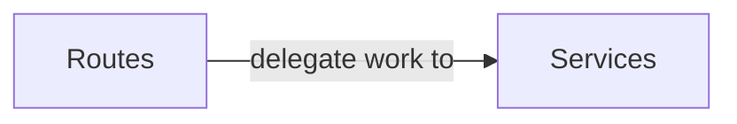

# Frontend

spiffworkflow-frontend is a React application that relies on the spiffworkflow-backend REST API.
We try to keep library bloat to a minimum.

## Libraries

### bpmn-js

The bpmn-js library is used to render and edit BPMN diagrams.
This library is maintained by the Camunda team.

### bpmn-js-spiffworkflow

These are SpiffWorkflow extensions to bpmn-js to create a better experience when executing BPMN diagrams using the SpiffWorkflow execution engine.

### rjsf/core, @rjsf/utils, etc.

React JSON Schema Form is used to build forms from JSON schemas.
You can attach JSON schemas to tasks that are meant to be completed by people (User Tasks), and the frontend will render a form for that task.
You can specify what data is required as well as how the form should look.

### @tanstack/react-query

We haven't deeply integrated this library, but it is used by the system that caches permission calls.

## Layers

### Routes

When the browser sees a URL like /hithere, it will render a route component to handle the request.

### Services

The route component may or may not delegate some of its work to a service.

## Deployment

The generated Docker image uses nginx to serve static HTML/CSS/JS files that are generated by the Vite build process.
These files can also be hosted on a CDN.
