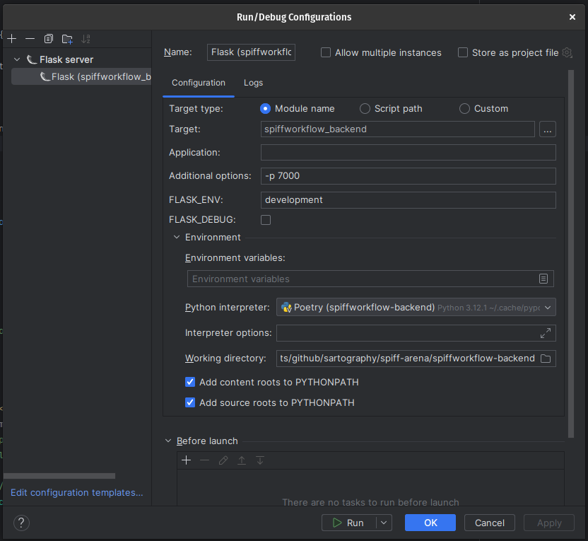

# PyCharm Setup Instructions

This guide provides instructions for setting up PyCharm IDE for SpiffWorkflow backend development.

## Pre-Requisites
* Before starting, ensure you can run `bin/run_server_locally` script successfully.
  This will prove that your libraries are properly configured.
* Checkout a git repository with sample process models such as our [Sample Process Models](https://github.com/sartography/sample-process-models)

## Step 1 - Python Interpreter
In the settings, ensure that you have configured your Python interpreter to use the poetry environment you have created.

## Step 2 - Configuration Settings
Create a config.py file in the src/instance directory, with the following base settings
```python
FLASK_SESSION_SECRET_KEY="[PUT SOME RANDOM STUFF HERE]"
SPIFFWORKFLOW_BACKEND_APPLICATION_ROOT="/"
SPIFFWORKFLOW_BACKEND_BPMN_SPEC_ABSOLUTE_DIR="[FULL PATH TO SAMPLE PROCESS MODEL GIT CLONE]"

# This will configure your application to use a built in login rather than
# relying on keycloak etc...
SPIFFWORKFLOW_BACKEND_AUTH_CONFIGS = [
    {
    "identifier":"default",
    "label":"internal openid",
    "uri":"http://localhost:7000/openid",
    "client_id":"spiffworkflow-backend",
    "client_secret":"JXeQExm0JhQPLumgHtIIqf52bDalHz0q"
    }
]

# You can modify the permissions by creating your own permissions file and setting it here.
# See example.yml in the src/spiffworkflow_backend/config/permissions directory
SPIFFWORKFLOW_BACKEND_PERMISSIONS_FILE_NAME="example.yml"
```

Check the default.py config file in src/spiffworkflow_backend/config directory for more options you can specify as needed.

## Step 3 - Run Configuration

Configure your Run configuration with the following settings:
* Select Flask Server as the run type
* Set the target to: spiffworkflow_backend
* Set the port to 7000 (-p 7000)
* See the screenshot below for reference:



## Step 4 - Code Formatting

We are using [Black](https://black.readthedocs.io/en/stable/) for code formatting.
To avoid the madness of having Black enforce one style, and your editor enforcing another, follow [the directions outlined here](https://black.readthedocs.io/en/stable/integrations/editors.html#pycharm-intellij-idea).

Start the application using the play / debug buttons.

## IMPORTANT
* Before committing changes to the repository, be sure to execute the `run_pyl` command in the top level spiff-arena directory and fix any issues it reports.
* When doing so, be sure to have the poetry environment *AT THAT TOP LEVEL* activated NOT the one in the backend. Otherwise, you will get invalid information.