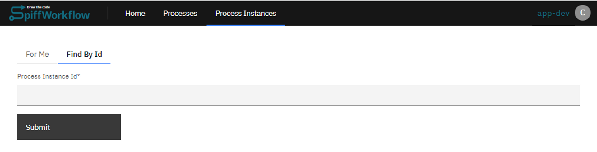
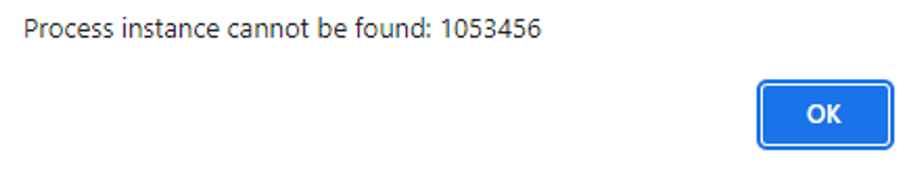

# Find an Instance assigned to someone else

| ⚙ How do I get there \| Menu hierarchy |
| ------------------------------------ |
| Process Instances > Find by Id       |
---

## 📔How to guide

### **Step 1: Go to Process Instance tab**

- To find a specific process instance, you can access the Process Instance tab.

### **Step 2: Search Id**

- Look for the option labeled "Find by Id" and select it. This will provide you with a field where you can enter the Process Instance Id number associated with the instance you are looking for.

### **Step 3: Submit Id**

- Once you have entered the Id, click on the "Submit" button to initiate the search.

---

 
## **Outcome**

| ✅ Success | 🚫 Error |
| --- | --- |
| The system will then display the parent process that contains the active instance searched for. [How to view process variables](https://github.com/sartography/spiff-arena/blob/main/docs/how_to/view_process_variables.md) | Process instance Id does not exist Repeat Step 2 with correct Id|
