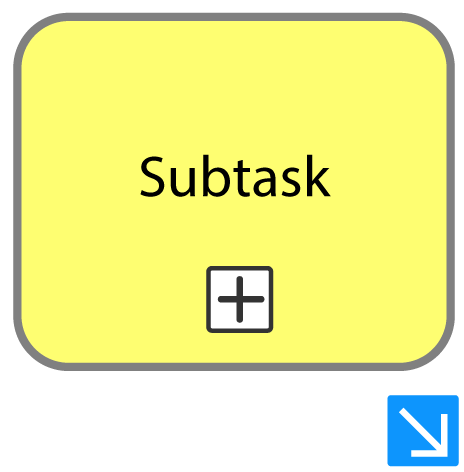
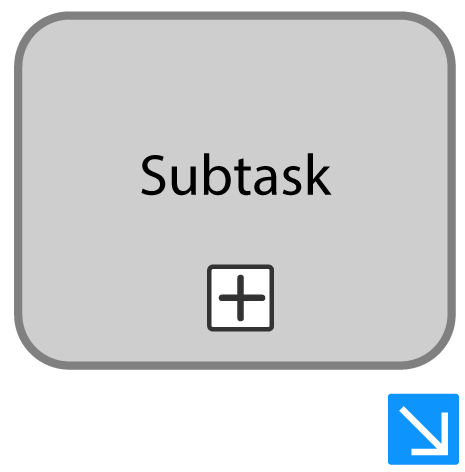
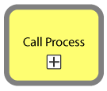

# Navigate to an active Process Instance

| ⚙ How do I get there \| Menu hierarchy |
| ------------------------------------ |
| [How to find an Instance assigned to someone else](https://github.com/sartography/spiff-arena/blob/main/docs/how_to/find_an_Instance_assigned_to_someone_else.md) 
[How to find an Instance assigned to myself](https://github.com/sartography/spiff-arena/blob/main/docs/how_to/find_an_Instance_assigned_to_myself.md)|      |
---

## 📔How to guide

If the desired task or process you would like to view is not found in the parent process, it is likely that you need to access the sub-process or call activity. Follow these steps:

### Subtask


#### Step 1: Locate current active sub task

#### Step 2: Select blue link icon

- Select the blue arrow located on the bottom right of the highlighted activity activity, indicated in yellow.
  



```{admonition} Note

🗒 Note: This could also be applied to activities that has been completed or is no longer active.
```



### Call Activitygit 

#### Step 1: Locate current active call activity

#### Step 2: Select activity

- Select the highlighted activity, indicated in yellow.



```{admonition} Note

🗒 Note: This could also be applied to activities that has been completed or is no longer active.
```

### Step 3: Select ‘View Call Activity Diagram’

A pop-up menu will appear. Select ‘View Call Activity Diagram’ to navigate to the sub-process.

```{image} images/call_activity_popup.png


---

 
## **Outcome**

| ✅ Success | 🚫 Error |
| --- | --- |
| You will be redirected to the corresponding diagram. Repeat the above steps until the highlighted activity becomes anything other than a call activity or sub task, which means you will find yourself in the lowest active process.|None

