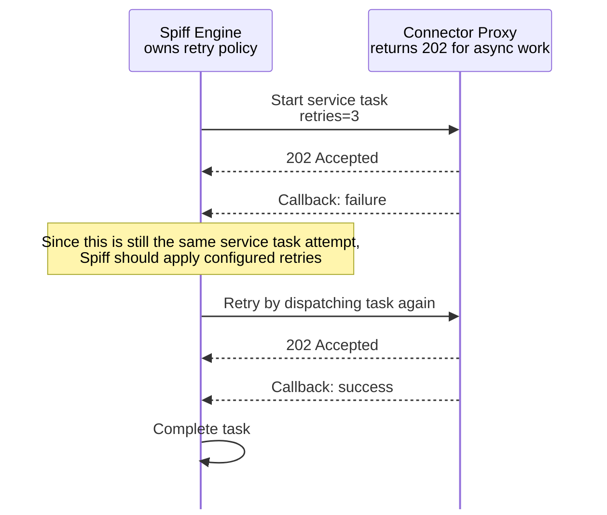

# Long-Running Service Tasks

For many cases, a service task responds immediately -- you might call one to get additional information for a form, send a text message, or update data in a database.
In all these cases the service task makes the call and moves on automatically.

However, in some cases the task may take a long time to complete, and you want to make the request and then wait for the service to call you back.
Previously you would need to create a message receive task to accept the callback.
This is no longer necessary.

## How It Works

When a service task makes a call, it always passes along a `spiff__callback_url` parameter.
If the called service returns a **202 (Accepted)** response, SpiffWorkflow will leave the service task in a **WAITING** state instead of advancing.

The process will pause at that task until the external service calls back with the result.

## Completing a Waiting Service Task

To complete the task, the external service should call the `spiff__callback_url` using a **PUT** request with a JSON body containing the result data.
The result data will be stored in the service task's configured result variable, and the process will continue.

If retries are configured, transient callback failures follow the service task retry policy.

### Callback Request Structure

See the examples for the proper request and response formats, see [Using Callback URLs](../../explanation/dev/connector_proxy_examples.md#using-callback-urls-long-running-tasks) in the Connector Proxy API Examples page.

## Summary

1. Configure a service task in your BPMN diagram as usual.
2. The external service receives the `spiff__callback_url` parameter along with the rest of the request.
3. If the service returns a **202** response, SpiffWorkflow will wait.
4. When ready, the service calls the `spiff__callback_url` with a **PUT** request and a JSON result.
5. The process resumes and continues to the next task.
