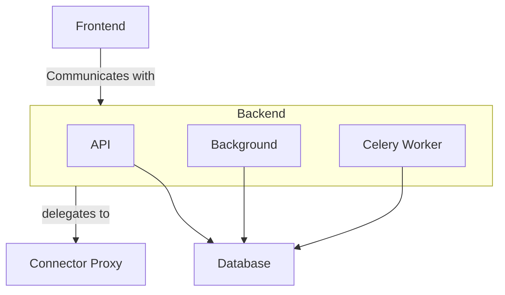

# Deploy

The minimal deployment is to mimic the docker-compose.yml file at the root of spiff-arena.
Steps for a more hardened production setup after that baseline include:

1. Setting up a MySQL or PostgreSQL database for Backend persistence (instead of SQLite)
2. Setting up a Redis/Valkey or RabbitMQ server for a Celery broker.
3. Separating out the Backend deployment into three deployments: 1) API, 2) Background, and 3) Celery worker.

API, Celery Worker, Connector Proxy, and Frontend can run any number of replicas.
The Background container is like a cron container, so it should run only one replica.

## Backend container commands

If you split Backend into API / Background / Celery worker containers, these are the entrypoints:

1. API (`spiffworkflow-backend`): `./bin/boot_server_in_docker` (image default)
2. Background (`spiffworkflow-backend-apscheduler`): `./bin/start_blocking_apscheduler`
3. Celery worker (`spiffworkflow-backend-worker`): `./bin/start_celery_worker`

Use the same backend env var set for all three containers, including Celery settings. At minimum, set these in API, Background, and Celery worker containers:

- `SPIFFWORKFLOW_BACKEND_CELERY_ENABLED=true`
- `SPIFFWORKFLOW_BACKEND_CELERY_BROKER_URL=...`
- `SPIFFWORKFLOW_BACKEND_CELERY_RESULT_BACKEND=...`
- `SPIFFWORKFLOW_BACKEND_CELERY_SQS_URL=...` (if using SQS broker)
- `SPIFFWORKFLOW_BACKEND_CELERY_RESULT_S3_BUCKET=...` (if using S3 result backend)

You do not need container-specific Celery env var differences for this split; `./bin/start_celery_worker` sets worker-only runtime flags internally.

If you use Redis for the Celery broker and/or result backend, a Redis container/service must also be running and reachable by all three backend containers. Example broker URL:

- `SPIFFWORKFLOW_BACKEND_CELERY_BROKER_URL=redis://spiff-redis:6379`

## Configuration

The app uses sqlalchemy and supports mysql, postgres, or sqlite.
You must set `SPIFFWORKFLOW_BACKEND_DATABASE_TYPE` to one of these three values as well as setting `SPIFFWORKFLOW_BACKEND_DATABASE_URI`.
Check the `default.py` config file in the `spiffworkflow-backend/src/spiffworkflow_backend/config` directory for more env vars.
