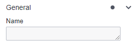
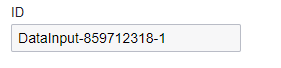
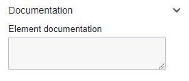
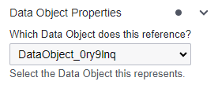

# Data Objects

In BPMN (Business Process Model and Notation), a data object represents the information or data used and produced by activities within a business process. It represents the data elements or artifacts that are relevant to the process and provides a way to model the flow of data through the process.
They help in clarifying the data flow and dependencies within the process, making it easier to understand how information is utilized and transformed throughout the process execution.

## Data Input Configuration

| 💻 Form | ⌨ Field Input  | 
| --- | --- | 
| | **Name:** Update Customer Information  |  
| | **ID:** Example - updateCustomerInformation    | 
| | **Element Documentation:** URL, Raw Data, Plain Text | 
| | **Element Documentation:** URL, Raw Data, Plain Text (only applicable for Data Object Reference) | 

### Data Input

 

Represents the data or information that is required as an input to initiate or execute a particular task or process. BPMN input defines the data elements that need to be provided or available for the task to be performed.

### Data Output

Signifies the data or information that is generated or produced as a result of executing a task or process. BPMN output describes the data elements that are produced or modified during the execution of the task. 

### Data Object Reference

A Data Object in BPMN typically represents a specific piece of information or a data entity that is exchanged or manipulated during the course of a business process. It can represent both physical and digital data. Examples of Data Objects include documents, forms, reports, databases, or any other data entity relevant to the process. 

### Data Store

 

A Data Store represents a persistent storage location where data is stored and retrieved during the course of a process. It typically represents a database, file system, or any other storage mechanism. Data Stores are used to depict the long-term storage of data that can be accessed by multiple activities or tasks within the process. They provide a centralized location for data storage and retrieval.

