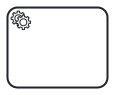
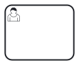
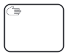
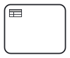
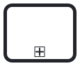
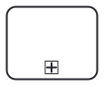
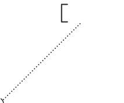

# Learn the Basics

## BPMN and SpiffWorkflow

Business Process Model and Notation (BPMN) is a diagramming language for specifying business processes. BPMN links the realms of business and IT, and creates a common process language that can be shared between the two.

BPMN describes details of process behaviors efficiently in a diagram. The meaning is precise enough to describe the technical details that control process execution in an automation engine. SpiffWorkflow allows you to create code to directly execute a BPMN diagram.

When using SpiffWorkflow, a client can create the BPMN diagram and still have their product work without a need for you to edit the Python code, improving response and turnaround time.

## BPMN Elements
BPMN (Business Process Model and Notation) elements are the building blocks used to model business processes visually. They represent different aspects of a process, such as tasks, events, gateways, and flows, and are used to describe the flow of activities, decisions, and data within a process.

### Events
Events, represented with circles, describe something that happens during the course of a process. There are three main events within business process modeling: start events, intermediate events, and end events.

| **Event** | **Symbol**| **Description** |
|-----------|-----------|-----------------|
| Start Event  |     | Signals the first step of a process                                                                                |
| Intermediate Event |           | Represents any event that occurs between a start and end event.                                                                                                |
| End event   |        | Signals the final step in a process.                                 |

### Gateways
Gateways represent decision points in a process. They determine which path the process will take based on certain conditions or rules. There are different types of gateways:

| **Gateway**   | **Symbol**| **Description** |
|---------------|-----------|-----------------|
| Exclusive gateway       |     | Evaluates the state of the business process and, based on the condition, breaks the flow into one or more mutually exclusive paths                                                                                   |
| Event-based gateway          |           | An event-based gateway is similar to an exclusive gateway both involve one path in the flow. In the case of an event-based gateway, however, you evaluate which event has occurred, not which condition has been met.                                                                                                 |
| Inclusive gateway        |         | An inclusive gateway breaks the process flow into one or more flows.                                                                          |
| Complex gateway |  | Complex gateways are only used for the most complex flows in the business process. They use words in place of symbols and, therefore, require more descriptive text. |

### Tasks
Tasks represent activities or work that needs to be performed as part of a process. They can be manual tasks that require human intervention or automated tasks that are executed by systems or applications.

| **Task**   | **Symbol**                                                | **Description**                                                                                                                                                                                    |
|---------------|------------------------------------------------------------------------------------------------|----------------------------------------------------------------------------------------------------------------------------------------------------------------------------------------------------|
| Service       |       | Task that uses a Web service, an automated application, or other kinds of service in completing the task.                                                                                          |
| Send          |         | Task that sends a Message to another pool. The Task is completed once the Message has been sent.                                                                                                   |
| Receive       |      | A Receive Task indicates that the process has to wait  for a message to arrive in order to continue. The Task is completed once the| message has     received.                                           |
| User          |         | A User Task represents that a human performer performs the Task with the use of a software application.                                                                                            |
| Manual        |       | A Manual Task is a Task that is performed without the aid of any business process execution engine or any application.                                                                             |
| Business Rule || Business Rule Task provides a mechanism for a process to provide input to a Business Rules Engine and then obtain the output provided by the Business Rules Engine. |
| Script        |        | A Script Task defines a script that the engine can interpret.                                                                                   |
| Call Activity        |         | A call activity allows you to call and invoke another process as part of this process.processes.                                                                                   |
| Sub-Process        |         | Sub-processes allow you to collapse and expand tasks to quickly convey information.                                                                                   |

### Artifacts
Artifacts are used to provide additional information or documentation within a process. They include data objects (representing information or data needed for the process), annotations (providing explanatory or descriptive text), and groups (used to visually group related elements).
| **Artifact**   | **Symbol**                                                | **Description**                                                                                                                                                                                    |
|---------------|------------------------------------------------------------------------------------------------|----------------------------------------------------------------------------------------------------------------------------------------------------------------------------------------------------|
| Data Object       |       | Data objects can represent data placed to the process, data resulting from the process, data that needs to be collected                                                                                         |
| Data Storage          |         | Data storage provides the ability to store or access data that is associated with a business model. If your process outputs any data, it will become necessary to store that data.                                                                                           |
| Group       | 
      | Groups organize tasks or processes that have significance in the overall process.​​                                          |
| Annotation          | 
        | Annotations allow you to describe the business process and flow objects in more detail.                                                                                            |
