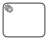
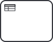

# Learn the Basics

## BPMN and SpiffWorkflow

Business Process Model and Notation (BPMN) is a diagramming language for specifying business processes. BPMN links the realms of business and IT, and creates a common process language that can be shared between the two.

BPMN describes details of process behaviors efficiently in a diagram. The meaning is precise enough to describe the technical details that control process execution in an automation engine. SpiffWorkflow allows you to create code to directly execute a BPMN diagram.

When using SpiffWorkflow, a client can create the BPMN diagram and still have their product work without a need for you to edit the Python code, improving response and turnaround time.

## BPMN Elements
BPMN (Business Process Model and Notation) elements are the building blocks used to model business processes visually. They represent different aspects of a process, such as tasks, events, gateways, and flows, and are used to describe the flow of activities, decisions, and data within a process.

### Tasks
Tasks represent activities or work that needs to be performed as part of a process. They can be manual tasks that require human intervention or automated tasks that are executed by systems or applications.

| **Task**   | **Symbol**                                                | **Description**                                                                                                                                                                                    |
|---------------|------------------------------------------------------------------------------------------------|----------------------------------------------------------------------------------------------------------------------------------------------------------------------------------------------------|
| Service       |

       | Task that uses a Web service, an automated application, or other kinds of service in completing the task.                                                                                          |
| Send          |          | Task that sends a Message to another pool. The Task is completed once the Message has been sent.                                                                                                   |
| Receive       |

        | A Receive Task indicates that the process has to wait  for a message to arrive in order to continue. The Task is completed once the| message has     received.                                           |
| User          | 

           | A User Task represents that a human performer performs the Task with the use of a software application.                                                                                            |
| Manual        |

         | A Manual Task is a Task that is performed without the aid of any business process execution engine or any application.                                                                             |
| Business Rule |

  | Business Rule Task provides a mechanism for a process to provide input to a Business Rules Engine and then obtain the output provided by the Business Rules Engine. |
| Script        | 

        | A Script Task defines a script that the engine can interpret.                                                                                   |                                                                |

### Events
Events, represented with circles, describe something that happens during the course of a process. There are three main events within business process modeling: start events, intermediate events, and end events.

| **Event**   | **Symbol**| **Description** |
|---------------|-----------|-----------------|
| Start Event     |     | Signals the first step of a process                                                                                |
| Intermediate Event |           | Represents any event that occurs between a start and end event.                                                                                                |
| End event          |        | Signals the final step in a process.                                 |

### Gateways
Gateways represent decision points in a process. They determine which path the process will take based on certain conditions or rules. There are different types of gateways:

| **Gateway**   | **Symbol**| **Description** |
|---------------|-----------|-----------------|
| Exclusive gateway       |     | Evaluates the state of the business process and, based on the condition, breaks the flow into one or more mutually exclusive paths                                                                                   |
| Event-based gateway          |           | An event-based gateway is similar to an exclusive gateway both involve one path in the flow. In the case of an event-based gateway, however, you evaluate which event has occurred, not which condition has been met.                                                                                                 |
| Parallel gateway       |        | Parallel gateways are used to represent two tasks in a business flow. A parallel gateway is used to visualize the concurrent execution of activities.                                           |
| Inclusive gateway        |         | An inclusive gateway breaks the process flow into one or more flows.                                                                          |
| Complex gateway |  | complex gateways are only used for the most complex flows in the business process. They use words in place of symbols and, therefore, require more descriptive text. |
|                                                                |

### Flows
Flows represent the sequence or direction of activities in a process. There are different types of flows in BPMN, including sequence flows, message flows, and association flows. Sequence flows indicate the order in which tasks are performed, message flows represent the exchange of messages between participants, and association flows connect data objects or artifacts to activities.

### Artifacts
Artifacts are used to provide additional information or documentation within a process. They include data objects (representing information or data needed for the process), annotations (providing explanatory or descriptive text), and groups (used to visually group related elements).

[def]: images/Untitled_2.png
