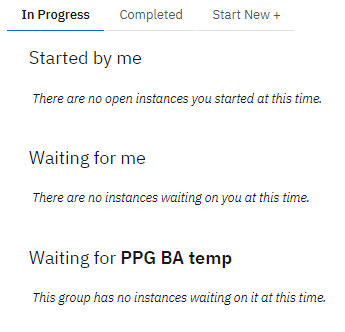
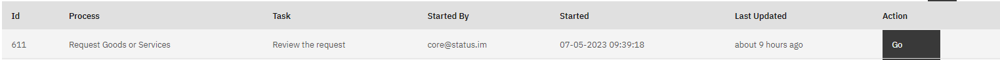
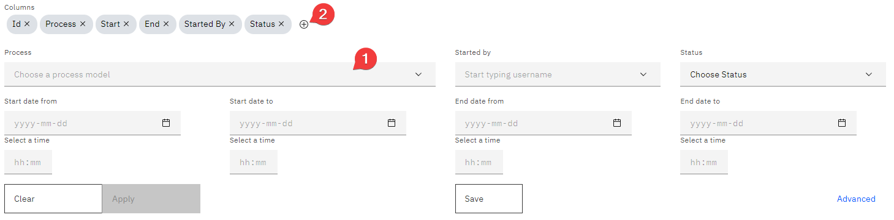

# Quick start guide

```{admonition} Welcome to the SpiffWorkflow quick start guide!
:class: info

👇 Throughout this step-by-step guide, we will walk you through key components of SpiffWorkflow, ensuring that you have a clear understanding of how to use the platform effectively.
```


## 🚀 Getting Started with SpiffWorkflow

SpiffWorkflow is a platform that facilitates the execution of business processes. To begin using SpiffWorkflow, it is necessary to acquire the appropriate credentials and URL. 

Upon receiving the credentials, here is how you can get started with SpiffWorkflow!

```{image} images/Untitled.png
:alt: Login Page
:width: 45%
```

```{image} images/Untitled_1.png
:alt: Home Page
:width: 53%
```

Here, we will provide a generic overview of each section step by step, allowing you to navigate and engage with the platform more effectively.

### Step 1: Explore the Home section

Once you are signed in, you can start exploring the home page. The home page has three tab sections: **In Progress**, **Completed** and **Start New**.  


- The "In Progress" section provides an overview of all ongoing process instances, including those initiated by you, those awaiting your action, or those awaiting action from a team you are a member of (Optional).
- The "Completed" section allows you to view all completed process instances, including those initiated by you, those initiated by other SpiffWorkflow users with tasks completed by you and if applicable, those with tasks completed by a group of which you are a member.
- The “Start New” section displays the processes you are permitted to start according to your role.

```{admonition} Key terms
:class: info
💡 **Process:** A process is a sequence of tasks that must be completed to achieve a specific goal.

**Instance:** An instance, on the other hand, represents a specific occurrence of a process. Each instance has its own set of data and state that is updated as the instance progresses through the workflow.
```

If you are a member of a team, you may also have one or more Instances with tasks waiting for [team name] lists as well.


### Step 2: Explore the Processes section


The process section provides a comprehensive view of the process ecosystem by showcasing process groups and process models. 

```{admonition} Process Groups
A **process group** is a way of grouping a bunch of **process models** and a **process model** contains all the files necessary to execute a specific process.
```
 


### Step 3: Explore the Process Instances section

The Process Instance section provides a detailed view of individual process instances, allowing you to track their progress and manage them effectively. 

This section includes essential information such as the instance ID, process name, the individual who started the process, the end date, and the current status. 


When getting started with SpiffWorkflow, it's essential to take the time to explore and familiarize yourself with the platform's interface and features. Feel free to ask questions about the platform's features or how to get started.

---

## 🌱 How to Start a Process

With SpiffWorkflow, you can easily initiate a new process instance. Here's a step-by-step guide on how to start a process.

### Step 1: Sign in and navigate to Home section

The first thing you need to do is sign in to your account on SpiffWorkflow. Once you're signed in, you'll see three tabs in the Home section: In progress, Completed, and Start New. If you want to start a new process, click the "Start New +" button. This will bring up "Processes I can start" section.


```{admonition} The Landing Page
:class: info
💡 The landing page will be the **Home section** by default, and you can navigate to other sections.
```

### Step 2: Select the process

Next, you will see a list of available processes that you have permission to start. Choose the process you want to initiate and click “Start”.


Congratulations! You have successfully started a new process instance in SpiffWorkflow.

---

## 🔄 How to respond to a request

When using SpiffWorkflow, knowing how to respond to requests is essential to the process. While each request may have unique requirements, the basic steps for responding are similar. The following steps will guide you through the process of responding to requests.

### Step 1: Navigate to the home page

Once you are signed in, navigate to the home page of SpiffWorkflow. On the home page, you will see a list of all the requests that are available to you.  

There will be three types of instances shown: 

- **Started by me:** This section shows a list of process instances that were started by you, providing you with an overview of the instances you have initiated.
- **Waiting for me:** This section displays a list of process instances with tasks assigned to you and are currently waiting for you to respond to.
- **Waiting for [team name]:** If you are a member of SpiffWorkflow**,** this section displays a list of process instances with tasks assigned to a group you are a member of and currently waiting for someone in that group to complete them.


In the case of new users who haven't started or been part of any process or been assigned to any team, you won't be able to see any items on the home page.



### Step 2: Respond to the request

Once you have identified the request you need to respond to, simply click on the 'Go' button in the action column to open it. Upon opening the process instance, you can respond to the request based on the requirements of that task. 

Depending on the task requirements, this may involve submitting additional information, reviewing the task or any other action item.



That's it! With these simple steps, you can efficiently review tasks in SpiffWorkflow.

---

## 📑 How to view process steps for the process you just started

After starting a process, it's important to stay informed about its progress. Even though you'll receive notifications when your attention is required, it's natural to be curious about what's happening in the background. Therefore, monitoring the process steps regularly is a great way to ensure everything is moving smoothly.

Here's how you can view the steps of the process you just started.

### Step 1: Navigate to the “Home” or “Process Instance” section

There are 2 ways of finding your process instances.

Option 1: Once you're signed in, navigate to the home section. Here you will find a list of all the processes instances you've initiated.


Option 2: You can also view the processes you have initiated in the **"Process Instances"** section.


### Step 2: Select the process instance you want to view

Click on the process instance you want to view. This will take you to the process instance information. Navigate to the BPMN diagram section. Here you can see the current task highlighted in **yellow**. The grey represents the path which was taken by the current process steps.


By following these steps, you can easily view the steps of the process you initiated and keep track of progress.

---

## 🏷️How to view the Process-defined metadata for a process instance

The Process-defined **metadata can provide valuable insights into its history, current status, and other important details that is specifically created and used within a particular process. With the SpiffWorkflow platform, users can easily view the metadata for a process instance.

To check the metadata of a process instance, follow these steps.

### Step 1: Navigate to the “Home” or “Process Instance” section as before

Once you're signed in, navigate to the home section. Here you will find a list of all the process instances you've initiated under **“Started by me”**.


### Step 2: View metadata for the selected process instance

Click on the process instance you want to view. Upon clicking this, you will be able to view the information about the given instance. You'll find the metadata under the details option in the process instance.


By following these simple steps, you can easily view the metadata for a process instance in SpiffWorkflow.

---

## 📂 How to view Process Model files

The process model files provide great transparency into our internal business rules and processes.  You can dig deep into the decision-making process and really understand how the process and organization operate. With these steps, you'll be able to access process models easily and efficiently.

### Step 1: Head over to the process section

Once you have successfully signed in, navigate to the process section. This section allows you to access all the process groups and process models you have access to.


### Step 2: Find and click on the process

You can either search for a process model using the search bar or navigate through displayed processes to find the process model.


### Step 3: Access the process model files

Once you have clicked on the process you want to view, a list of the model files that are associated with the process will appear. 


By following these simple steps, you can easily view process model files in SpiffWorkflow.

---

## 🔍 How to view and filter process instances

As you work on various process instances in SpiffWorkflow, you may want to view and filter some of them. This can help you track the status of various instances and manage them more efficiently. 

Here are the steps to view and filter process instances in SpiffWorkflow.

### Step 1: Navigate to Process Instances

Once you are signed in, navigate to the "Process Instances" section. Within the "Process Instances" section, you'll see a list of all the instances for the processes you can access.


### Step 2: Click on Filter option

To filter the list, click on the "Filter" option. This will expand the filter section where you will be able to provide details about the process instance. This allows you to enter various details, including the process model, start date, end date, and time. To refine your search, you can enter multiple filter parameters.


### Step 3: Apply Filters

Once you have entered all the relevant filter details, click on the "**Apply**" button to apply the filters. The system will then display all the process instances matching the input details.


To filter process instances by **process-defined metadata**, follow these steps:

- Search for the specific **process** you want to filter and click on the column option to select metadata options.



- The metadata fields will be displayed in dropdown. Select the field you want to display and Click on "**Save**" to apply the changes.


- After saving the details, the newly created column will be displayed. Finally click on “**Apply“** button to reflect the changes.


### (Optional) Step 4: Save Perspectives

If you wish to save the perspectives, click on the "**Save**" button. 


A prompt will appear, allowing you to provide a name for the identifier associated with the saved filter. Enter a descriptive name for the filter identifier and “**Save”** changes. Now you can search for specific processes using Process Instance Perspectives.


### (Optional) Step 5: Filter by ID


If you want to filter by ID, go to the "Find by Id" section of the page. Enter the ID and click "Submit". The system will show you the process instance with the corresponding ID.

You can now view the process instances that you filtered for and take appropriate action based on their status. This can help you manage your workflows more efficiently and keep track of the progress of various process instances.