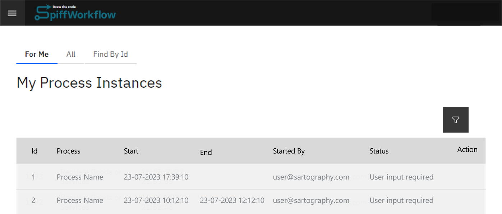
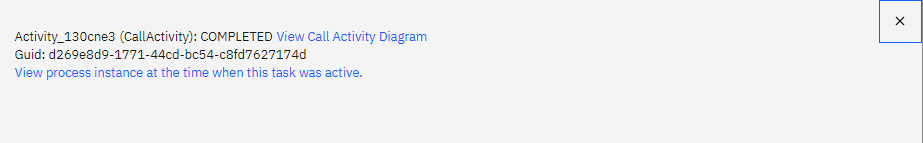

# Assign Task to a Different User

| ⚙ How do I get there \| Menu Hierarchy |
| -------------------------------------- |
| Follow steps to [find a Process Instance](../spiffsparkles/find_a_process_instance.md)|

A task is typically allocated to a specific user, who is then tasked with its completion. However, there could be various scenarios where the user might not be able to complete the task within the set timeframe. In such instances, the task can be **reassigned to a different user**. This facilitates a seamless continuation of the process from where the initial user left off, enabling them to proceed with the next task when they're prepared.

## Change Lane Owner

> **Step 1: Find 'Process Instance'**

- The process instance will be assigned to another user and the task can be found by seraching for the Id in the ['Find By Id'](../spiffsparkles/find_a_process_instance.md) tab.



> **Step 2: Navigate to the Active Process Id**

Follow steps to [navigate to the Active Process Instance.](../spiffsparkles/navigate_to_an_active_process_instance.md)


```{admonition} Note
⚠ The task needs to be active for you to be able to amend it. Completed process instances can not be resumed at a previous point.
```

> **Step 3: Suspend the Process Instance**

Follow steps to [suspend process.](../spiffsparkles/suspend_resume_terminate)

```{admonition} Note
⚠ Note: Only Admin users will be able to complete this step.
```

> **Step 4: Find Previous Active Task**

- Identify the particular task within the workflow. It's generally located before the currently active task and prior to the lane where the task gets assigned to the lane owner.

- Click on this task to trigger a popup menu,
- Select the option "View process instance at the time when this task was active."


The activity is now highlighted in yellow. This means that this was the view of the activity when it was active. 

> **Step 5: Reset Process**

The activity needs to be reset to its previous active state to enable the changes required by the Admin. 

- Click on the previous active task and select 'Reset Process Here'.

> **Step 6: Edit Task Data**

- Click on the now active activity then click "Edit"

> **Step 7: Change Lane Owner**

> Change the Lane Owner Property from the current owner to new owner.

```Python
"lane_owners": {
	"Approver": [
		"newuser@spiffworkflow.com"
	]
}
```

> **Step 8: Save Instance**

- Click "Save" to apply field changes to the Instance.

> **Step 7: Execute Task**

- Select to "Execute Task". This will execute the user task with applied changes.

> **Step 8: "Resume" process instance.**

- Follow steps to [resume process.](../spiffsparkles/suspend_resume_terminate)

> **Step 9: Refresh page**

- After a few seconds, refresh the page to ensure that the workflow has progressed to the next activity

| ✅ Success                                                    |
| ------------------------------------------------------------ | 
| With the current activity successfully completed and the workflow advanced to the next stage, the remaining steps of the process can now smoothly proceed. | 
