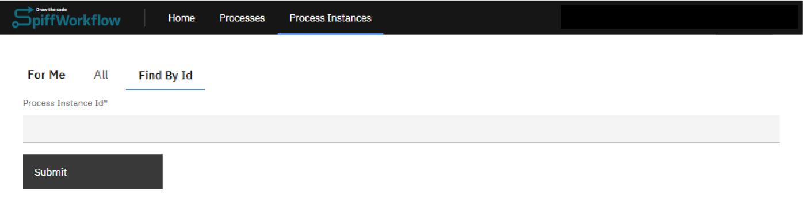
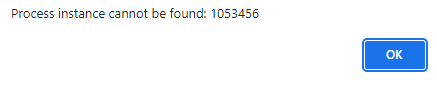

# Find an Instance

| ⚙ How do I get there \| Menu Hierarchy |
| -------------------------------------- |
| Process Instances > For me             |

## Assigned to myself

> **Step 1: Go to 'Process Instance' tab****

- To find a process instance assigned to you, you can access the Process Instance tab.

 

> **Step 2: Browse list**

- Look for the option labeled "For me" and select it. This will provide you with a list of User Tasks assigned to you.

```{admonition} Note
⚠ **Apply a filter if the Instance can not easily be located**.
```

 

> **Step 3: Select Instance**

- Select the associated entry from list.
- You will be redirected to the process instance selected. 
- *Apply a filter if the Instance can not easily be located**.

| ✅ Success                                                    | 🚫 Error                                                      |
| ------------------------------------------------------------ | ------------------------------------------------------------ |
| The system will then display the parent process that contains the active instance searched for. | What if this was not successful. Add section to troubleshoot?

---

| ⚙ How do I get there \| Menu Hierarchy |
| -------------------------------------- |
| Process Instances > By Id             |

## By Id

If a process is not in your designated queue, it may be assigned to someone else. Generally, finding a process instance by its Id is useful to locate and view the progress of any process instance.

> **Step 1: Go to 'Process Instance' tab**

- To find a specific process instance, you can access the Process Instance tab.

 

> **Step 2: Select "Find by Id"**

- Look for the option labeled "Find by Id" and select it. This will provide you with a field where you can enter the Process Instance Id number associated with the instance you are looking for.

 

> **Step 3: Select Instance**

- Once you have entered the Id, click on the "Submit" button to initiate the search. 

| ✅ Success                                                    | 🚫 Error                                                      |
| ------------------------------------------------------------ | ------------------------------------------------------------ |
| The system will then display the parent process that contains the instance searched for. | What if this was not successful. Add section to troubleshoot? |

