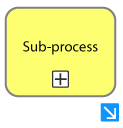
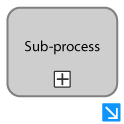
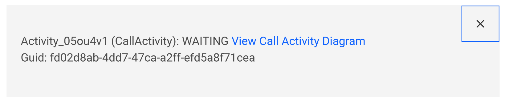

# Navigate to a Process Instance

| ⚙ How do I get there \| Menu Hierarchy |
| -------------------------------------- |
| Follow steps to [Find a Process Instance](../spiffsparkles/find_a_process_instance.md) |

If you can't find the desired task or process you wish to view in the parent or primary process, it's likely that you need to access a sub-process or call activity.

## Inside a Sub-Process

> **Step 1: Locate the Current Active Sub-task**

You might be interested in a process instance that you've specifically searched for, or one that is currently assigned to you. However, when you attempt to view the instance, it might be in a waiting state, denoted by a sub-process highlighted in yellow.

> **Step 2: Select the Link**

- Select the blue arrow located at the bottom right of the highlighted activity, which is indicated in yellow.



```{admonition} Note
⚠ Note: This method can also be applied to a process instance that has already been completed.
```

 

| ✅ Success |  
|  :----:  | 
| You will be navigated to the corresponding diagram. Continue to repeat the aforementioned steps until the highlighted activity is neither a call activity nor a sub-process. At this point, you'll be at the lowest level of the active process.|

## Inside a Call Activity

> **Step 1: Locate the Current Active Call Process**

You might be interested in a process instance that you've specifically searched for, or one that is currently assigned to you. However, when you try to access the instance, it might be waiting within a 'call activity', identifiable by a Call Activty highlighted in yellow.

> **Step 2: Select the Activity**

- Select the highlighted activity, indicated in yellow.


```{admonition} Note
⚠ Note: This method can also be applied to a process instance that has already been completed.

```

> **Step 3: Confirm Redirect**

- A popup message will appear. Select "View Call Activity Diagram" to navigate to the child process of the current view.

 

| ✅ Success |  
|  :----:  | 
| You will be navigated to the corresponding diagram. Continue to repeat the aforementioned steps until the highlighted activity is neither a call activity nor a sub-process. At this point, you'll be at the lowest level of the active process.|

