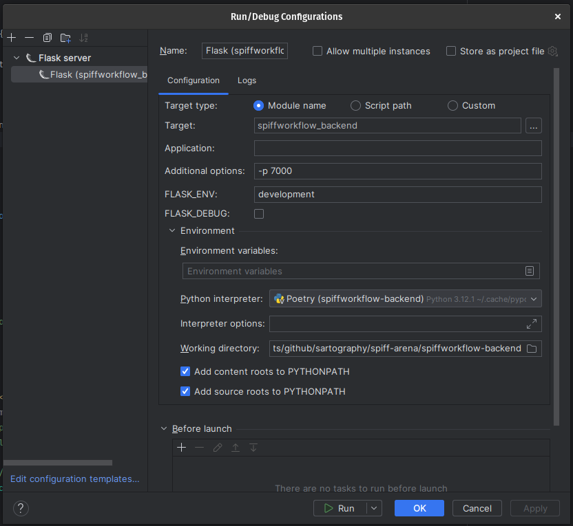

# PyCharm Setup Instructions

## Pre-Requisites
* Before starting, be sure you can run bin/run_server_locally script successfully.
This will prove that your libraries are properly configured.
* Checkout a git repository with sample process models such as our [Sample Process Models](https://github.com/sartography/sample-process-models)


## Step 1
Under settings assure you have set your python interpreter up to point at the poetry environment you have created

## Step 2
Create a config.py file in the src/instance directory, with the following base settings
```python
FLASK_SESSION_SECRET_KEY="[PUT SOME RANDOM STUFF HERE]"
SPIFFWORKFLOW_BACKEND_APPLICATION_ROOT="/"
SPIFFWORKFLOW_BACKEND_BPMN_SPEC_ABSOLUTE_DIR="[FULL PATH TO SAMPLE PROCESS MODEL GIT CLONE]"

# This will configure your application to use a built in login rather than
# relying on keycloak etc...
SPIFFWORKFLOW_BACKEND_AUTH_CONFIGS = [
    {
    "identifier":"default",
    "label":"internal openid",
    "uri":"http://localhost:7000/openid",
    "client_id":"spiffworkflow-backend",
    "client_secret":"JXeQExm0JhQPLumgHtIIqf52bDalHz0q"
    }
]

# You can modify the permissions by creating your owm permissions file and setting it here.  See [example.yml](../src/spiffworkflow_backend/config/permissions/example.yml)
SPIFFWORKFLOW_BACKEND_PERMISSIONS_FILE_NAME="example.yml"
```


Checkout [the default.md config file](./src/spiffworkflow_backend/config/default.py) for more options you can specify here as needed.

## Step 3

Configure your Run configuration with the following settings:
* select Flask Server as the run type
* set the target to:  spiffworkflow_backend
* set the port to 7000 (-p 7000)
* make sure your python interpreter is set to the poetry location
* 


Start it up using the play / debug buttons.


